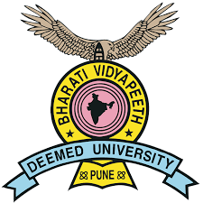

<a href="https://www1.biu.ac.il/indexE.php">
    </img>
</a>

## Ph.D. Bioinformatics

**University:** [Bar-Ilan University](https://en.wikipedia.org/wiki/Bar-Ilan_University)

**Duration:** March, 2017 – Present (3 Years, 4 Mos)

**Place:** [Safed](https://en.wikipedia.org/wiki/Safed), [Israel](https://en.wikipedia.org/wiki/Israel)

  

<a href="https://bvuniversity.edu.in/">
    </img>
</a>

## M.Sc. Bioinformatics

**University:** [Bharati Vidyapeeth Deemed University](https://en.wikipedia.org/wiki/Bharati_Vidyapeeth)

**Duration:** 2013 – 2015 (2 Years)

**Place:** [Pune](https://en.wikipedia.org/wiki/Pune), [India](https://en.wikipedia.org/wiki/India)

  

<a href="http://www.spuvvn.edu/">
    </img>
</a>

## B.Sc. Bioinformatics
**University:** [Sardar Patel University](https://en.wikipedia.org/wiki/Sardar_Patel_University)

**Duration:** 2010 – 2013 (3 Years)

**Place:** [Vallabh Vidyanagar](https://en.wikipedia.org/wiki/Vallabh_Vidyanagar), [India](https://en.wikipedia.org/wiki/India)

  
