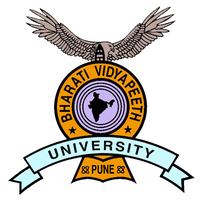

# Education

 

<!-- bio-info-->

    

## [Ph.D.](https://en.wikipedia.org/wiki/Doctor_of_Philosophy) [Bioinformatics](https://en.wikipedia.org/wiki/Bioinformatics)
** University:** [Bar-Ilan University](https://en.wikipedia.org/wiki/Bar-Ilan_University)

** Duration: ** March, 2017 - Present (3 Years, 4 Mos)

** Place: ** [Safed](https://en.wikipedia.org/wiki/Safed), [Israel](https://en.wikipedia.org/wiki/Israel)

 
 

    

## [M.Sc.](https://en.wikipedia.org/wiki/Master_of_Science) [Bioinformatics](https://en.wikipedia.org/wiki/Bioinformatics)
** University:** [Bharati Vidyapeeth Deemed University](https://en.wikipedia.org/wiki/Bharati_Vidyapeeth)

** Duration: ** 2013 - 2015 (2 Years)

** Place: ** [Pune](https://en.wikipedia.org/wiki/Pune), [India](https://en.wikipedia.org/wiki/India)

 
 

    

## [B.Sc.](https://en.wikipedia.org/wiki/Bachelor_of_Science) [Bioinformatics](https://en.wikipedia.org/wiki/Bioinformatics)
** University:** [Sardar Patel University](https://en.wikipedia.org/wiki/Sardar_Patel_University)

** Duration: ** 2010 - 2013 (3 Years)

** Place: ** [Vallabh Vidyanagar](https://en.wikipedia.org/wiki/Vallabh_Vidyanagar), [India](https://en.wikipedia.org/wiki/India)

 
 
